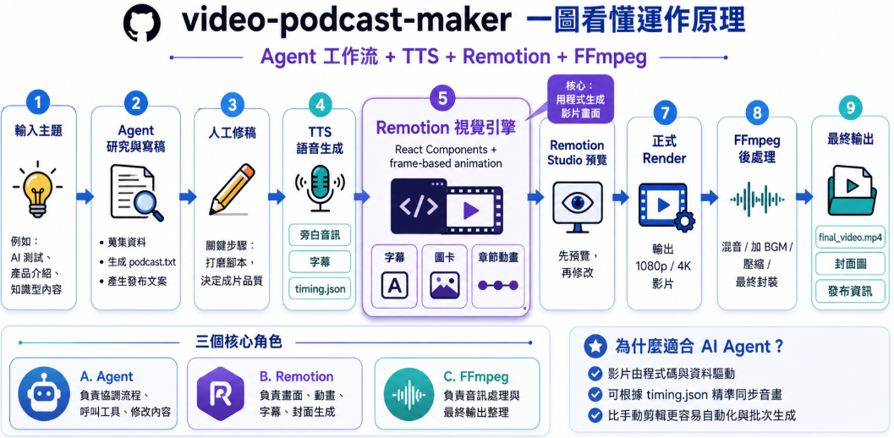

# Video Podcast Maker Demo：用 AI 工作流產出 OpenClaw 介紹影片



這個 repo 用來展示 **video-podcast-maker** 的影片生成流程，以及一支實際產出的 OpenClaw 介紹 demo。

本 repo 只保留兩個重點：

```text
README.md
openclaw-intro.mp4
```

也就是：

- `README.md`：說明 video-podcast-maker 的用途、流程與本次 demo 的限制
- `openclaw-intro.mp4`：最後產出的 demo 影片

---

## video-podcast-maker 專案

本 demo 使用的工具是：

https://github.com/Agents365-ai/video-podcast-maker

**video-podcast-maker** 是一個用來產生「旁白型知識影片」的工作流工具。

它的核心概念是：

> 先把主題整理成 podcast 腳本，再產生語音、字幕、時間軸，最後交給 Remotion 製作影片畫面。

換句話說，它不是單純的影片剪輯器，也不是只產生一段 TTS 音訊。  
它比較像是一個把「主題」轉成「可播放影片」的自動化 pipeline。

---

## 它解決什麼問題？

如果要手動做一支知識型影片，通常會經過很多步驟：

```text
想主題
→ 寫腳本
→ 配音
→ 對字幕
→ 切章節
→ 做畫面
→ 對時間軸
→ 輸出影片
```

這些步驟分散在不同工具裡，很容易變成重複勞動。

video-podcast-maker 的價值是把這些流程串起來，讓產出流程變成：

```text
Topic
→ podcast.txt
→ podcast_audio.wav
→ podcast_audio.srt
→ timing.json
→ Remotion video
→ MP4
```

---

## 主要產物

video-podcast-maker 通常會產出以下檔案：

| 檔案 | 用途 |
|---|---|
| `podcast.txt` | 影片旁白腳本 |
| `podcast_audio.wav` | TTS 產生的旁白音訊 |
| `podcast_audio.srt` | 對應音訊的字幕 |
| `timing.json` | 每個 section 的時間區間 |
| `phonemes.json` | 語音輔助資料，可用於更細緻的動畫或字幕同步 |
| Remotion component | 用 React / Remotion 組出影片畫面 |
| `.mp4` | 最終輸出的影片 |

---

## 使用到的技術

### 1. video-podcast-maker

負責整體影片產出流程。

它會協助整理主題、產生腳本、生成 TTS 音訊、字幕與 timing，並讓後續 Remotion 可以依照這些素材做畫面。

### 2. MiniMax M2.7

這次 demo 實際使用的是 **MiniMax M2.7** 作為 coding agent 背後的模型。

需要特別說明的是，這和 video-podcast-maker 原本較推薦或常見搭配的 **GPT、Claude、Gemini** 等較高能力模型不同。  
因此，實際生成品質、畫面設計能力、Remotion component 穩定度、動畫規劃能力，可能會和官方示範或使用高階模型時有差異。

本 demo 可以視為：

> 使用 MiniMax M2.7 跑 video-podcast-maker workflow 的實測結果。

也就是說，這個 demo 展示了流程可以被跑通，但不代表 video-podcast-maker 在更強模型下的最佳產出上限。

### 3. Edge TTS

用來產生中文旁白音訊。

這次 demo 使用繁體中文語音，讓影片可以直接用旁白形式呈現，而不是單純顯示文字。

### 4. Remotion

Remotion 是用 React 產生影片的框架。

在這個 workflow 中，Remotion 的角色是把：

```text
音訊
字幕
section timing
React 視覺元件
```

組合成可以播放與輸出的影片。

---

## 整體流程

這次 demo 的產出流程可以概括成：

```text
1. 定義影片主題
2. 產生 podcast 腳本
3. 確認腳本內容與長度
4. 使用 Edge TTS 產生旁白
5. 產生 SRT 字幕與 timing.json
6. 使用 Remotion 建立影片畫面
7. 在 Remotion Studio 預覽
8. Render 成 MP4
```

---

## Demo 主題：OpenClaw

這次實際產出的 demo 是一支 OpenClaw 介紹影片。

影片主題是：

> OpenClaw 是什麼？  
> 為什麼它不是單一 Coding Agent，而更像 Agent routing / orchestration layer？

影片內容介紹了：

- OpenClaw 的定位
- 為什麼單一 Agent 在任務變多時容易混亂
- Agent、Route、Binding、Tool、Agent Team 等核心概念
- 多 Agent 工作流的基本想法
- OpenClaw 和一般 Coding Agent 的差異

---

## Demo 影片

請查看 repo 中的影片檔案：

```text
openclaw-intro.mp4
```

這支影片展示了 video-podcast-maker 的完整產出流程：

- 從主題生成旁白腳本
- 使用 TTS 產生語音
- 自動產生字幕
- 依照 timing 安排影片段落
- 用 Remotion 產生動態畫面
- 最後輸出成 MP4

---

## 這個 demo 想展示什麼？

這個 demo 的重點不是單純介紹 OpenClaw，而是展示：

> video-podcast-maker 可以把一個技術主題，轉成一支有旁白、有字幕、有時間軸、有畫面的影片。

也就是從：

```text
一個主題
```

變成：

```text
一支完整影片
```

中間包含腳本、語音、字幕、時間軸與畫面生成。

---

## 產出限制與觀察

這次 demo 的生成過程中，使用 **MiniMax M2.7**，而不是 GPT、Claude、Gemini 這類 video-podcast-maker 原本較推薦或常見搭配的模型。

因此產出結果有幾個需要注意的地方：

- 腳本與 TTS 流程可以順利完成
- Remotion component 可以產生可播放影片
- 但動畫設計、畫面節奏、scene 對齊與整體視覺穩定度，和更高能力模型可能有差距
- 實際製作時仍需要人工多次預覽與修正
- 若使用更強的 coding model，理論上 Remotion 視覺設計與一次生成成功率可能會更好

所以這個 repo 比較適合作為：

```text
video-podcast-maker workflow 實測 demo
```

而不是：

```text
video-podcast-maker 最佳視覺品質展示
```

---

## 為什麼使用 Remotion？

Remotion 很適合這類影片，因為它可以用 React 的方式描述畫面。

也就是說，影片畫面不是手動剪輯出來，而是透過程式產生。

這對技術型 demo 很有價值，因為畫面可以根據資料動態生成，例如：

- 根據 section timing 切換場景
- 根據字幕時間顯示文字
- 根據旁白內容安排 visual beats
- 使用 React component 管理視覺結構
- 用程式控制動畫、節點、流程圖與進度條

---

## Repo 內容

```text
.
├── README.md
└── openclaw-intro.mp4
```

這個 repo 不包含完整原始碼與中間產物。  
它主要是用來展示 video-podcast-maker 的成果與流程說明。

---

## Summary

video-podcast-maker 的價值在於把影片產出流程串起來：

```text
主題
→ 腳本
→ 語音
→ 字幕
→ 時間軸
→ Remotion 畫面
→ MP4
```

本 repo 的 `openclaw-intro.mp4` 就是這個流程的實際成果。

同時，本 demo 也補充了一個實測觀察：

> 使用不同 coding model，video-podcast-maker 的 Remotion 視覺生成效果會有差異。  
> 本次使用 MiniMax M2.7，因此結果應視為 MiniMax M2.7 條件下的 workflow demo。
